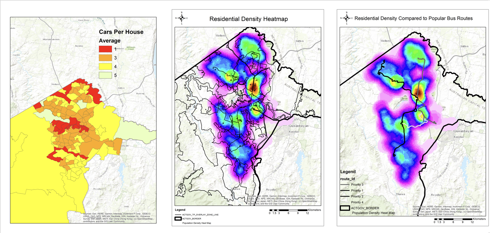

# Planner Space

See Below: Canberra's Most userd and CO2 generating Bus routes. 

| Route ID | Colour | 
|----------|--------|
| 300        | Red    | 
| 200        | Orange |
| 005        | Yellow | 

### Route Summary Table
| Route ID | Revenue per year(Considering OP cost) | Riders per year | Carbon Output (t) per year|
|----------|------------|-----------|------|
| 300      | $5,963,472 | 4,018,512 | 1590 |         
| 200      | $2,845,683 | 159,798   | 1130 |
| 005      | $494,973   | 27,795    | 1484 |

## Areas to target
### Residential heat Map - Residential heat Map overlaid with Existing Routes - Car per house hold map

                                   
## Time to pay off  the "Electric Switch"
This table displays to route planners how long it would to take to gain benefits from switching to an electric bus at a cost of approximately $3,000,000.
This model uses Brisbanes new Metro "bus' as a case study.

| Route ID | No. of Elec Busses needed | Time to pay off Electric Bus  | 
|----------|--------------|-------------------------------|
| 300        | 6             | 8 years                       |
| 200        | 4             | 10 years                       | 
| 005        | 4             | 55 years                      | 

### Want more? 
To see this website from a Transport Commuter's perspective click [Here](user.md) 
