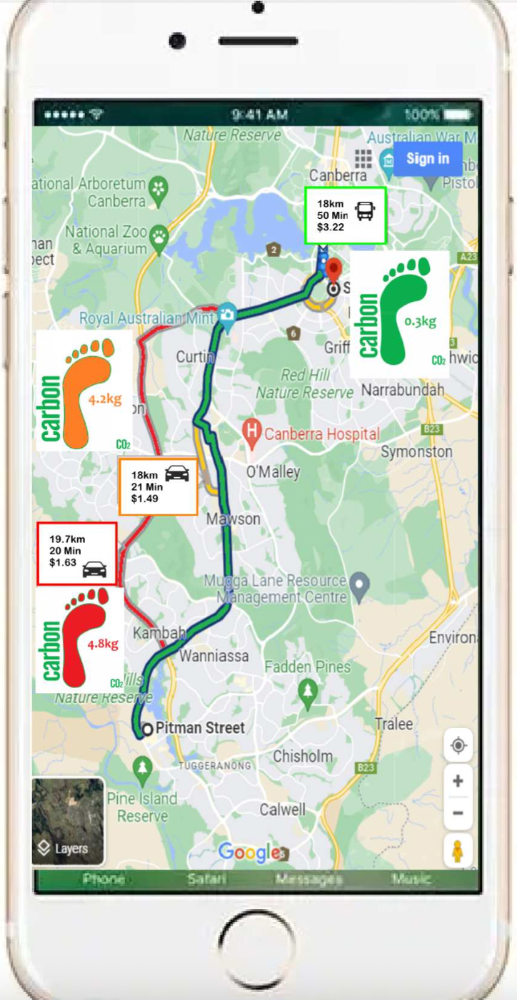

## Govhack22 Project for Public Transport  

This project aims to used both ABS and ACT supplied data to improve sustainable behaviours around the use of public transport in the ACT.

The TransCO2 website does this by addressing the uptake, CO2 output and Pricing of the ACT's public transport usage from two sides.
The first being the side of the commuter and the second being the side of the transport planner.

To start using the TransCO2 Website from a Commuter Preceptive please click [here](user.md)
The planners side of the Website is [here](Planner_veiw.md)

### Features of the TransCO2 Website

**Commuter Side**
- Planning your route and seeing how much carbon your choosen Transport produces 
- Easy Comparison of route options in terms of both time carbon foot print 
- A leader board of your friends transport carbon footprint compaired to yours, making a competition out of emissions reduction 
- A CLear display of your Carbon foot print in the "Carbon Awareness Dash board" to help you make informed decisions 
**Transport Planner Side**
- A map the most used and Highest emissions bus routes in the network allowing quick identification.
- This is also displayed in table format increasing the ease of use
- A basic Calculation of how long it would take to pay off switching to an electric bus based of mileage, Ridership and CO2 emissions

### Introduction of a Mobile Site
Whilst the TransCO2 does work on mobile in the current state with further developments a specific mobile app could be developed.
Some screenshots of this potential app can be seen below.

<!-- img align="left" width="" height="" src="./moblie.PNG"  NOT USED--> 

 

Project by: Brock Walls, Josh Schuck, Riley Small, Franz Strasser, Liam Maki & Max McDonald
