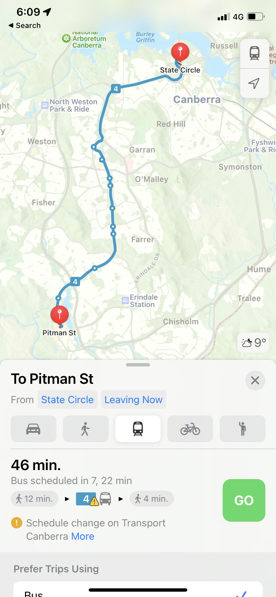

## Govhack22 Project for Public Transport  

This project aims to used both ABS and ACT supplied data to improve sustainable behaviors around the use of pulbic transport in the ACT.

The TransCO2 website does this by approaching the uptake, CO2 output and Pricing of the ACT's public transport useage from two sides.
The first being the side of the commuter and the secound being the side of the transport planner.

To start using the TransCO2 Website from a Commuter Prepective please click [here](user.md)
The planners side of the Website is [here](Planner_veiw.md)

### Moblie Site
Whlist the TransCO2 does work on moblie in the current state with further devlopments a specific moblie app could be developed.
Some screenshots of this potential app can be seen below.

 

Project by: Brock Walls, Josh Schuck, Riley Small, Franz Strasser, Liam Maki & Max McDonald
