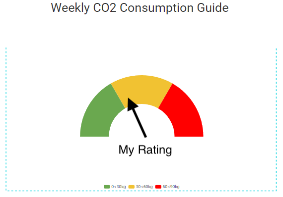

# Commuter Space

## Todays Route

 
  
  

### My Carbon Awareness Dashboard 

 

 

### This Weeks Carbon Leader Board
 

### Carbon Offset Progarm 
Choose a Project from the emissions reduction fund to offset your transport emissions.
Individuals Can choose how they offset their trip, the Application utilises data from the Australian Clean Energy Regulator to allow users to support and utilise projects in their region.

The project Mapping files utilise a georeferencing algorithm to show projects in the vicinity of the trip so local projects are supported.

 

 

### Want more? 
To see this website from a Transport Planners perspective click [Here](Planner_veiw.md) 
